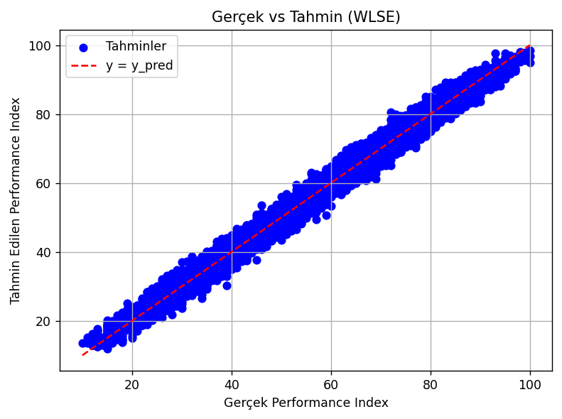
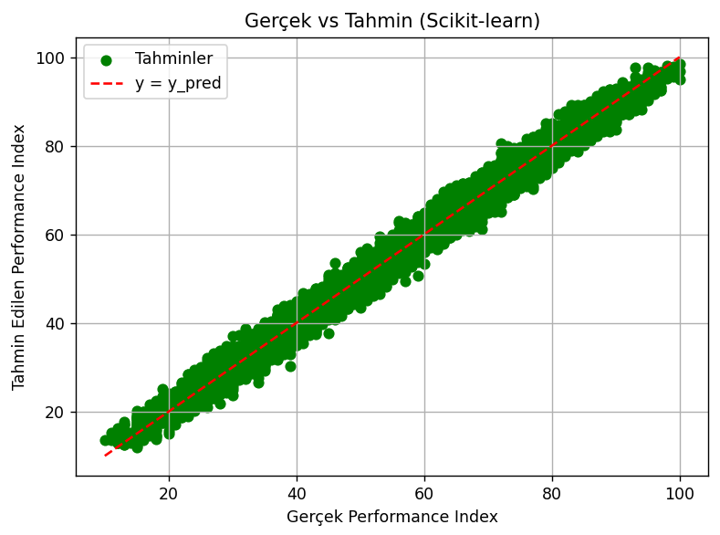

# Lineer Regresyon

##  Teorik Tanım

**Lineer regresyon**, bağımlı bir değişkenin (target) bir veya birden fazla bağımsız değişken (feature) ile doğrusal ilişkisini modelleyen istatistiksel bir tekniktir.

Model denklemi genel olarak şu şekildedir:

$y = \theta_0 + \theta_1 x_1 + \theta_2 x_2 + \dots + \theta_n x_n$

Bu projede iki farklı yaklaşımla lineer regresyon uygulanmıştır:

* **WLSE (Weighted Least Squares Estimate)**: Kapalı form çözüm şu formülle hesaplanır:

$\theta = (X^T X)^{-1} X^T y$

* **Scikit-learn LinearRegression**: Python kütüphanesi olan Scikit-learn, aynı lineer modeli optimize ederek eğitmek için kullanılmıştır.

Her iki model de aynı temel prensibe dayanmakta olup, farklı implementasyon teknikleri kullanır.

---

##  Bu Projede Ne Yapıldı?

### 1. Veri Seti:

Kullanılan veri seti: `Student_Performance.csv`

| Değişken Adı                     | Açıklama                             |
| -------------------------------- | ------------------------------------ |
| Hours Studied                    | Öğrencinin çalışma süesi (saat)      |
| Previous Scores                  | Önceki sınav başarı ortalaması       |
| Extracurricular Activities       | Sosyal etkinliklere katılım (Yes/No) |
| Sleep Hours                      | Uyku süesi (saat)                    |
| Sample Question Papers Practiced | Çözülen soru sayısı                  |
| Performance Index (Target)       | Çıktı başarı endeksi                 |

### 2. WLSE Modeli:

* Bias (θ₀) ve katsayılar θ₁, θ₂, ... kapalı form çözüm ile hesaplandı.
* Gerçek vs Tahmin değerleri grafikleştirildi.
* Ortalama kare hata (MSE) hesaplandı.

### 3. Scikit-learn Modeli:

* `LinearRegression` sınıfı ile aynı veriye model eğitildi.
* Katsayılar ve bias alındı.
* Ortalama kare hata (MSE) hesaplandı.

---

##  Model Sonuçları ve Karşılaştırma

###  WLSE Modeli Çıktıları

```
θ₀ (bias): -34.0756
θ1 (x1 için katsayı): 2.8530
θ2 (x2 için katsayı): 1.0184
θ3 (x3 için katsayı): 0.6129
θ4 (x4 için katsayı): 0.4806
θ5 (x5 için katsayı): 0.1938

Ortalama Kare Hata (MSE): 4.1514
```

Regresyon Denklemi:

$$
y = -34.0756 + 2.8530 x_1 + 1.0184 x_2 + 0.6129 x_3 + 0.4806 x_4 + 0.1938 x_5
$$

###  Scikit-learn Lineer Regresyon Modeli

```
θ₀ (bias): -34.0756
θ1 (x1 için katsayı): 2.8530
θ2 (x2 için katsayı): 1.0184
θ3 (x3 için katsayı): 0.6129
θ4 (x4 için katsayı): 0.4806
θ5 (x5 için katsayı): 0.1938

Ortalama Kare Hata (MSE): 4.1514
```

Regresyon Denklemi:

$$
y = -34.0756 + 2.8530 x_1 + 1.0184 x_2 + 0.6129 x_3 + 0.4806 x_4 + 0.1938 x_5
$$

###  Neden Aynı Sonuçlar Elde Edildi?

WLSE ve Scikit-learn aynı matematiksel temele dayanır:

* Her ikisi de doğrusal regresyon modelinde $\min_\theta \| X\theta - y \|^2$ ifadesini minimize eder.
* Veri küçük ve temiz olduğunda, scikit-learn arka planda WLSE (Normal Equation) yöntemini uygular.
* Bu nedenle, bias ve katsayılar birebir aynıdır.

Farklı yöntemlerle hesaplanmalarına rağmen, veriye ve probleme aynı şekilde yaklaştıkları için **aynı regresyon denklemi ve aynı MSE** değeri elde edilmiştir.

---

## Görselleştirme

### WLSE Yöntemi


### Scikit-learn Yöntemi



