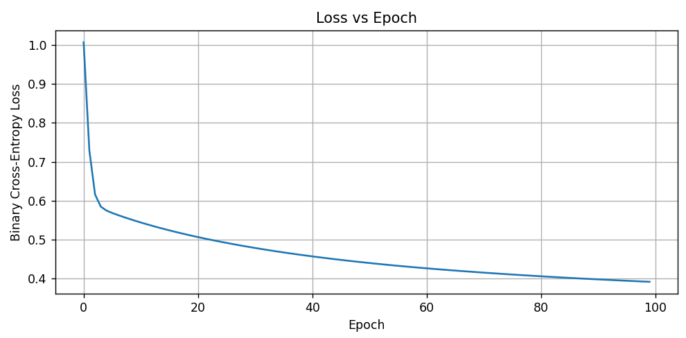
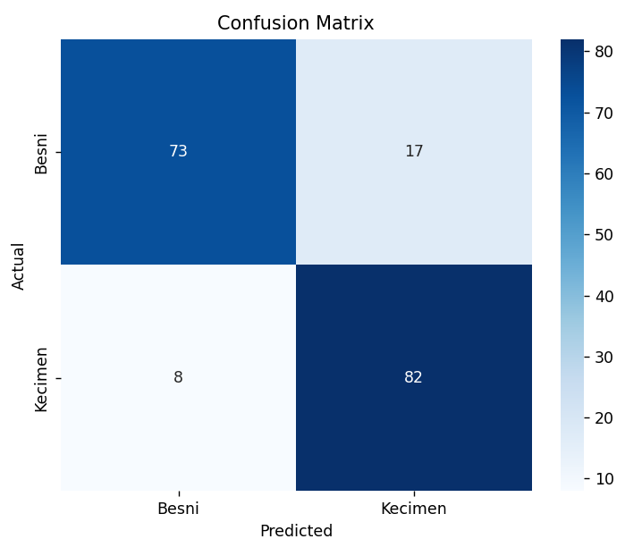

# Forward and Backward Propagation Neural Network


Bu projede, Raisin Dataset üzerinde ileri (forward) ve geri (backward) yayılım algoritmalarını temel alan bir yapay sinir ağı (neural network) sıfırdan geliştirilmiştir. Amaç, scikit-learn gibi hazır makine öğrenmesi modelleri kullanmadan, yalnızca NumPy ile ileri ve geri yayılım mantığını elle kodlamaktır.

##  Genel Bilgi

* **Veri Seti**: [Raisin Dataset](https://www.kaggle.com/datasets/nimapourmoradi/raisin-binary-classification)
* **Amaç**: Üzüm türlerini (Besni ve Kecimen) ayırt eden bir sinir ağı modeli oluşturmak
* **Problem Türü**: İkili sınıflandırma (Binary Classification)
* **Girdi Boyutu**: 7 sayısal özellik
* **Sınıf Etiketleri**: 0 (Besni), 1 (Kecimen)

##  Veri ve Yöntem

###   Veri Ön İşleme

* `LabelEncoder` ile ırk sınıfları sayısallaştırıldı (Besni=0, Kecimen=1)
* `MinMaxScaler` ile tüm özellikler \[0, 1] aralığına normalleştirildi
* Veri %80 eğitim, %20 test olarak ayrıldı

###  Model Yapısı

* Giriş Katmanı: 7 nöron (girdi özellikleri)
* Gizli Katman: 10 nöron, ReLU aktivasyonu
* Çıkış Katmanı: 1 nöron, sigmoid aktivasyonu
* Kayıp fonksiyonu: Binary Cross-Entropy
* Öğrenme oranı: 0.1
* Epoch sayısı: 100

###  Uygulanan Temel Bileşenler

* **İleri Yayılım (Forward Propagation)**: Ağırlıklarla hesaplama ve aktivasyon
* **Geri Yayılım (Backward Propagation)**: Türevlerle hata dağıtımı
* **Gradient Descent**: Ağırlıkların elle güncellenmesi
* **Aktivasyon Fonksiyonları**: ReLU, Sigmoid

##  Sonuçlar ve Yorumlama

###  Test Doğruluğu

Model test verisi üzerinde **%86.11** başarı sağlamıştır:

```text
Epoch 0, Loss: 0.8049 
Epoch 10, Loss: 0.6839
Epoch 20, Loss: 0.6402
Epoch 30, Loss: 0.6090
Epoch 40, Loss: 0.5831
Epoch 50, Loss: 0.5610
Epoch 60, Loss: 0.5415
Epoch 70, Loss: 0.5240
Epoch 80, Loss: 0.5078
Epoch 90, Loss: 0.4929
Test Accuracy: 0.8611
```

###  Loss vs Epoch Grafiği




Grafikten net görüyoruz ki:

Başta hızlı bir düşüş var → öğrenme düzgün başlıyor

Sonlara doğru azalan ama devam eden bir azalma var → overfitting yok, loss azalıyor

100 epoch sonunda loss ≈ 0.39–0.40 civarına oturmuş

Bu da gösteriyor ki gradyan iniş düzgün çalışıyor, öğrenme oranı (learning rate) ideal seçilmiş.

###  Confusion Matrix



Sınıflar arasında dengesiz öğrenme olmamış, her iki sınıf da başarılı şekilde tahmin edilmiştir.

###  Yorum

* Model, veriyi iyi öğrenmiş ve test verisi üzerinde genellenebilirlik göstermiştir.
* Loss ve accuracy metrikleri, gradyan iniş ve geri yayılım algoritmasının doğru şekilde çalıştığını göstermektedir.
* Aktivasyon fonksiyonları ve öğrenme oranı ideal seçilmiştir.

---

